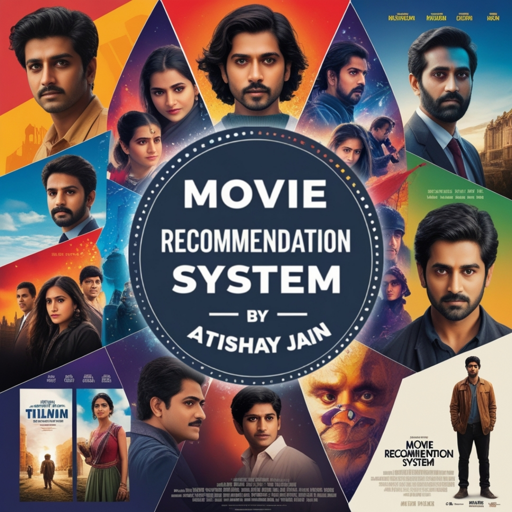

# Movie Recommendation System

◦ Built a content-based movie recommender system that suggests the top 5 most similar movies based on user input.
 
◦ Utilized a Kaggle dataset and applied core ML techniques including data cleaning, feature engineering, feature extraction, word stemming, and vectorization.
 
◦ Implemented cosine similarity to compute movie relevance and generate accurate recommendations.
 
◦ Developed an interactive web interface using Streamlit for seamless user experience.
 
◦ Deployed the application using Render and GitHub, enabling public access via a live URL.
 
